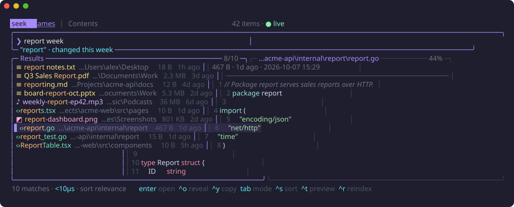

<div align="center">

# seek

**Instant file search for your terminal.**
Fuzzy-find any file across all your drives in milliseconds, search inside files, and preview them, all without leaving the keyboard.

[](https://github.com/ItsFurai/Seek-CLI/actions/workflows/ci.yml)
[](https://github.com/ItsFurai/Seek-CLI/releases/latest)
[](go.mod)
[](LICENSE)



[Install](#install) · [Usage](#usage) · [Search syntax](#search-syntax) · [Keys](#keys) · [How it works](#how-it-works) · [Contributing](CONTRIBUTING.md) · [Changelog](CHANGELOG.md)

</div>

## Features

- **Fast.** Searches over a million files as you type, in about 20 ms per keystroke.
- **Fuzzy matching.** `rprt` finds `report`. Matches in the file name rank above matches in folder names.
- **Plain-language filters.** `.pdf >10mb week` means PDF files over 10 MB changed this week. The search box shows how it read your query.
- **Search inside files.** Press `tab` for a parallel grep with smart case and optional regex. Results stream in while it searches.
- **Preview pane.** Syntax-highlighted code, folder listings, and content matches with the matching line in view.
- **Always up to date.** On Windows the index updates live as files change; `seek watch` keeps it current when the UI is closed.
- **Scriptable.** `seek find` and `seek grep` print plain results for pipes and scripts.
- **One small binary.** About 8 MB, no runtime or C dependencies, for Windows, macOS and Linux on x86-64 and ARM64.

## Install

### Download a release

Get a build for your system from the [latest release](https://github.com/ItsFurai/Seek-CLI/releases/latest), unzip it, and put the folder on your `PATH`. Each release includes `checksums.txt` to verify the download.

On macOS, the builds aren't code-signed, so clear the quarantine flag once:

```bash
xattr -d com.apple.quarantine seek
```

### With Go

Needs Go 1.24 or newer:

```bash
go install github.com/ItsFurai/Seek-CLI/cmd/seek@latest
```

### From source

```bash
git clone https://github.com/ItsFurai/Seek-CLI.git
cd Seek-CLI
go build -o seek ./cmd/seek
```

On Windows, use `-o seek.exe`.

## Usage

Run `seek`. The first launch builds the index: every fixed drive on Windows, or your home folder on macOS and Linux. That takes about a minute for a million files, and you can watch the progress in the header.

```bash
seek                      # open the search UI
seek report .pdf          # open it with a query already typed
seek -c TODO .go          # open it in content-search mode
seek find budget .xlsx    # print matching paths, for scripts
seek grep "api_key" .env  # print matching lines from inside files
seek index [folders...]   # rebuild the index (optionally for specific folders)
seek watch                # keep the index current in the background
seek stats                # show what's indexed
```

To jump to a folder from PowerShell, pick it in the UI and press `enter`:

```powershell
cd (seek pick)
```

## Search syntax

Type words to fuzzy-match file names, and add any of these to narrow the results down:

| Type | Meaning |
|---|---|
| `report budget` | fuzzy words; all must match |
| `.pdf` · `.jpg,.png` | file type |
| `is:image` | a whole kind: `image` `video` `audio` `doc` `code` `archive` `app`, or `dir` / `file` |
| `>10mb` · `<1kb` · `1mb..1gb` | size |
| `today` · `yesterday` · `week` · `month` · `year` | changed today, yesterday, or in the last 7 / 30 / 365 days |
| `<7d` · `>1y` | changed in the last 7 days / not changed for a year (`min h d w mo y`) |
| `photos/` | folders named like "photos" |
| `E:\work` · `~/Documents` | only inside that folder |
| `in:projects` | anywhere under a folder whose name contains "projects" |
| `'foo` · `^foo` · `foo$` · `!foo` | exact text · name starts with · path ends with · exclude |

The bottom border of the search box spells out how seek read your query, for example `"report" · PDF files · over 10 MB · changed this week`.

<details>
<summary>More details</summary>

- To search for one of the shorthand words itself, put a `'` in front: `'today`.
- The older `key:value` forms still work: `ext:pdf`, `size:>10mb`, `mod:<7d`, `in:E:\work`.
- In a shell, quote `>` and `<` so they aren't treated as redirects: `seek find report '>10mb'`.
- Content search uses smart case: `todo` matches any capitalization, `TODO` matches exactly.

</details>

## Keys

| Key | Action |
|---|---|
| `↑` `↓` · `pgup` `pgdn` | move through results |
| `enter` | open with the default app |
| `ctrl+o` | reveal in Explorer / Finder |
| `ctrl+y` | copy the path |
| `tab` | switch between name search and content search |
| `ctrl+s` | sort by relevance, newest or largest |
| `ctrl+x` | toggle regex (content search) |
| `ctrl+t` | show or hide the preview · `shift+↑↓` scrolls it |
| `ctrl+r` | rebuild the index |
| `F1` | help |
| `esc` | clear the query, then quit |

The mouse works too: scroll, click to select, and click a selected row to open it.

### Reading the results

Each row starts with a symbol, and its color shows what kind of item it is:

| Symbol | Color | Kind |
|---|---|---|
| `▸` | blue, bold | folder |
| `‹›` | green | code and config (`.go`, `.py`, `.js`, `.json`, `.yaml`, …) |
| `≡` | yellow | documents and text (`.pdf`, `.docx`, `.txt`, `.md`, `.csv`, …) |
| `◩` | pink | images (`.png`, `.jpg`, `.heic`, `.svg`, …) |
| `♪` | purple | audio and video (`.mp3`, `.flac`, `.mp4`, `.mkv`, …) |
| `▣` | red-orange | archives and disk images (`.zip`, `.7z`, `.iso`, …) |
| `⚙` | red | programs (`.exe`, `.msi`, `.dll`, shortcuts, …) |
| `·` | grey | anything else |

The dim text after a name is the folder it's in, orange letters are the ones that matched, and the right side shows the size and how long ago the item changed.

## How it works

**Indexing.** A pool of workers reads many folders at once. On Windows each directory listing already includes sizes and dates, so no extra call per file is needed. Paths are sorted and prefix-compressed on disk: about 29 MB for a million entries, stored in `%LOCALAPPDATA%\seek\index.bin` (or the OS cache folder; override it with `SEEK_INDEX`).

**Searching.** Every keystroke scores all entries in parallel across your CPU cores. Each core keeps its own top results, which are merged at the end. All paths sit in one block of memory, so there's almost nothing for the garbage collector to scan.

**Staying current.** On Windows, seek watches each drive with `ReadDirectoryChangesW` and applies changes in small batches, about once a second. Each update creates a new index version that shares the old one's memory, so searches already running are never disturbed. If changes arrive faster than Windows can report them, seek falls back to a full rescan. An index more than 30 minutes old is rescanned in the background on launch. macOS and Linux have no equivalent single watch for a whole drive, so they rescan every 10 minutes instead.

**Content search.** Each candidate file is first scanned once for the literal text, and files without it are skipped. Binary files are skipped too, and matches stream into the UI while the search continues.

## Platform notes

- **Windows** gets every feature, including live index updates.
- **macOS and Linux** rescan periodically instead of updating live, and `seek index` defaults to your home folder.
- **Linux:** copying a path (`ctrl+y`) needs `xclip`, `xsel` or `wl-clipboard`.

## Contributing

Bug reports, ideas and pull requests are welcome. See [CONTRIBUTING.md](CONTRIBUTING.md) for how to build, test and submit changes, and [SECURITY.md](SECURITY.md) to report a vulnerability privately.

## License

[MIT](LICENSE) © 2026 Basel Elgamal
